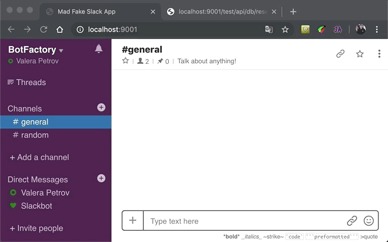
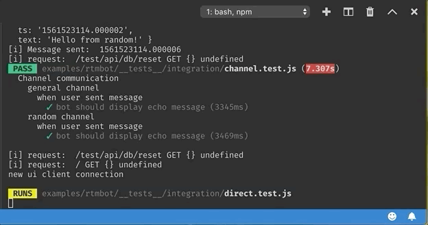

# mad-fake-slack

### Demo of interaction with bot from examples folder (Демо взаимодействия с ботом, через UI `mad-fake-slack`)

### VSCode console output demo (Демо вывода информации в консоль VSCode)

### Bot + `mad-fake-slack` integration tests example demo (Демо запуска примера интеграционных тестов Bot + `mad-fake-slack`)

# `EN`

# The purpose of this project
* Helps to test your bot or application without using a real `Slack` server. It is also useful for writing integration and `e2e` tests.

### How to setup a project locally for development (VSCode are used to develop the project.)
* In order to set up the working environment you need:
    * `Docker` application for your OS, you can download here https://docs.docker.com/install/
* Clone this project to your favorite location using command (for example):
    * `git clone https://github.com/maddevsio/mad-fake-slack.git`
* Next, you need to install `VSCode`
    * Here are 3 quick steps to get started doing Visual Studio Code Remote Development:
        * Install the [stable version of VSCode](https://code.visualstudio.com)
        * Get the [Remote Development Extension Pack](https://aka.ms/VSCodeRemoteExtensionPack), which installs support for WSL, SSH, and Containers and is the easiest way to get started. If you don't need them all, you can uninstall the individual extensions.
        * Read the [Docs](https://aka.ms/vscode-remote). Try the [Dev Container samples](https://github.com/search?q=org%3AMicrosoft+vscode-remote-try-&unscoped_q=vscode-remote-try-).
    * Next you need to open the project in `VSCode`
    * Watch [Remote-Containers](https://youtu.be/TVcoGLL6Smo) on YouTube
    * `Reopen in Container` popup message will appear.
    * `VSCode` restarts and begins to create and configure containers. (Check that Docker service has been started)
    * Then you can open VSCode terminal, which, if everything is successful, will be connnected to the docker container for development, with all necessary tools installed in it. You will see a greeting like `root@e6e415dc0d02: /workspace` or `#/`in the case of `/bin/sh`.
    * Now you can work on project.`VSCode` is connected to the environment in the docker.

### Proof of work
* In the current terminal VSCode, execute the command `npm start`
* After that go to the URL `http://localhost:9001` in the browser (The current simple Fake Slak interface will be displayed)
* To demonstrate, you need to open another remote terminal VSCode and execute the command `npm run example:rtmbot` (This command will run simple client bot application)
* Then you will see in `UI` at the address `http://localhost:9001` a message from the bot. If you type a message and send it to the bot (using Enter or the "Send" button, you will receive an answer, with your message back).

### How to run example of integration tests between bot (from examples folder) and mad-fake-slack
* For executing integration tests was used `jest-puppeeter`.
    * `jest` used as platform for writing tests in consolidation with power of `puppeeter`
* You need to run command inside VSCode console `npm run example:rtmbot:integration`

### Testing api
* Now supported following test api methods:
  * `GET` `/test/api/db/reset` - resets current db (If you will refresh mad-fake-slack ui in your browser, you will see that your conversational data has disappeared)

# `RU`

# Цель данного проекта
* Помочь в тестировании вашего бота или приложения, без использования реального сервера `Slack`. Пригодится так же для написания интеграционных и `e2e` тестов.

### Как поднять проект локально для разработки (Разработка ведется в VSCode)
* Для того чтобы поднять рабочее окружение тебе понадобится:
  * `Docker` приложение для твоей ОС скачать можно тут https://docs.docker.com/install/
* Склонируйте текущий проект в любое удобное для вас расположение (используя к примеру, слудующую команду):
    * `git clone https://github.com/maddevsio/mad-fake-slack.git`
* Далее необходимо установить `VSCode`
  * Вот 3 быстрых шага, чтобы начать делать удаленную разработку кода Visual Studio
    * Установите [стабильную сборку VSCode](https://code.visualstudio.com).
    * Получите [пакет расширений для удаленной разработки](https://aka.ms/VSCodeRemoteExtensionPack)
    * Прочитайте [документы](https://aka.ms/vscode-remote). Попробуйте [образцы Dev Container](https://github.com/search?q=org%3AMicrosoft+vscode-remote-try-&unscoped_q=vscode-remote-try-).
* Далее нужно открыть проект в `VSCode`.
* Посмотрите [видео по Remote-Containers](https://youtu.be/TVcoGLL6Smo) на Ютубе.
* Появится всплывающее сообщение `Reopen in Container`.
* VSCode перезагрузится и начнет поднимать контейнеры (Убедитесь что сервис докера запущен).
* Далее можно вызвать терминал `VSCode`, который если все будет успешно, будет привязан к докеру для разработки, c установленными в нем всем необходимым. Вы увидите приветсвие типа `root@e6e415dc0d02:/workspace` или `#/`в случае `/bin/sh`.
* Теперь можно разрабатывать, рабочее окружение поднято в докере и VSCode подключен к окружению в докере.

### Демонстрация работы
* Далее в текущем терминале `VSCode`, выполнить команду `npm start`
* И в браузере перейти по URL `http://localhost:9001` (Будет отображен текущий простой интерфейс Фейк-Слака)
* Для демонстрации, нужно открыть еще один удаленный терминал `VSCode` и выполнить команду `npm run example:rtmbot`
* Далее вы увидите в `UI` по адресу `http://localhost:9001` сообщение от бота. Если вы наберете сообщение и отправите его боту (используя Enter или кнопку "Отправить", то получите ответ, с вашим сообщением обратно).

### Как запустить пример интеграционных тестов между ботом (из папки examples) и mad-fake-slack
* Для выполнения интеграционных тестов был использован `jest-puppeteer`.
    * `jest` используется в качестве платформы для написания тестов в консолидации с силой `puppeeter`
* Вам необходимо запустить следующую команду в консоле VSCode `npm run example:rtmbot:integration`

### Тестовый api
* Сейчас поддерживаются следующие тестовые апи:
  * `GET` `/test/api/db/reset` - сбрасывает текущую базу данных (если вы обновите пользовательский интерфейс mad-fake-slack в своем браузере, вы увидите, что ваши данные разговора исчезли)

### [DOCKER IMAGE | Докер образ](docs/DOCKER.md)
* [EN] coming soon... 
* [RU] скоро будет...

### [ROADMAP | Путь развития](docs/ROADMAP.md) 
* [EN] coming soon... 
* [RU] скоро будет...

### [LICENSE | Лицензия](LICENSE)